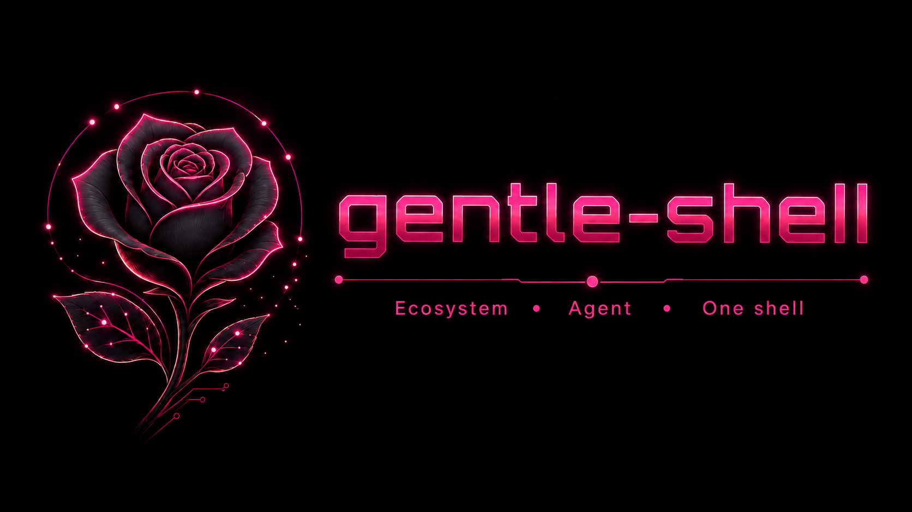
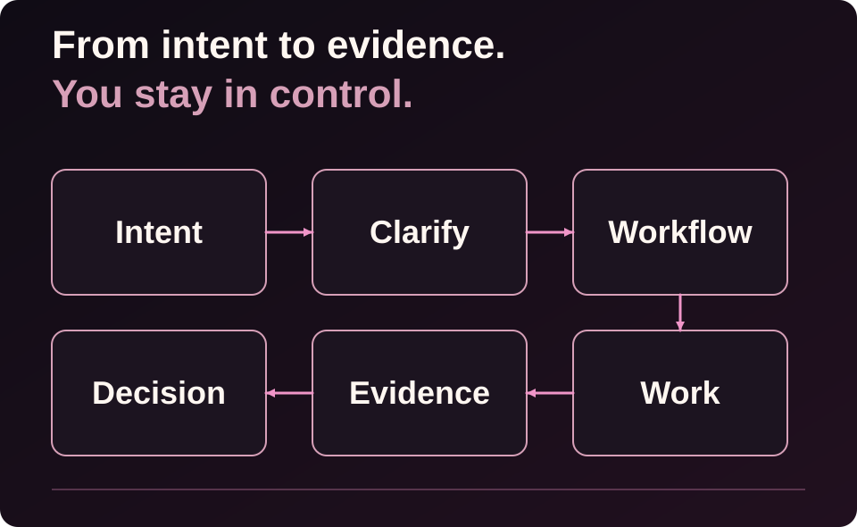
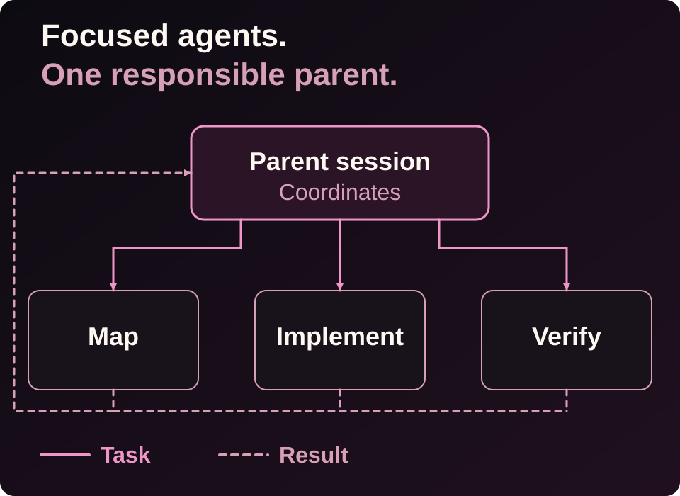
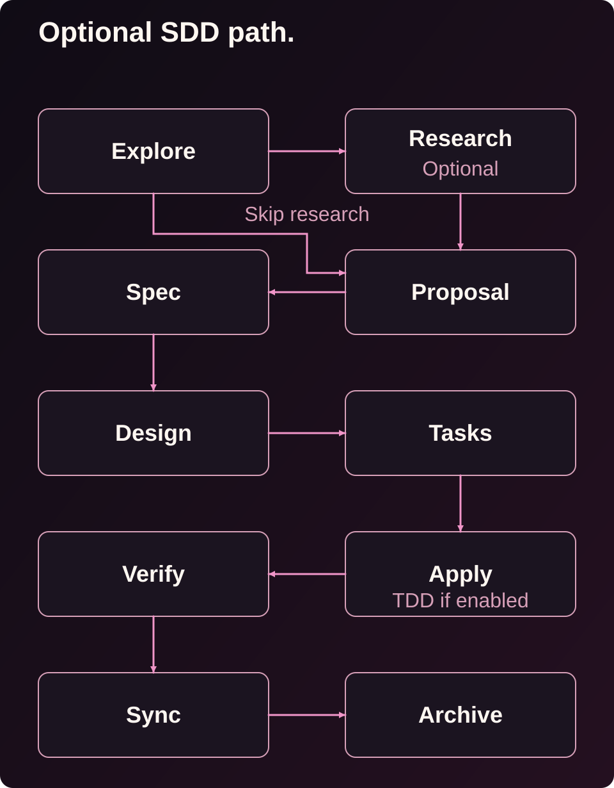
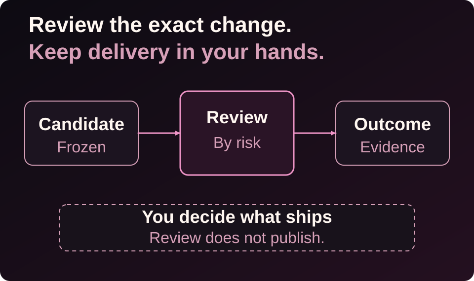

<a id="top"></a>

<div align="center">
  
</div>

<h1 align="center">gentle-shell™</h1>

<p align="center"><strong>Your coding agent for controlled development in the workspace you lead.</strong></p>

<p align="center">
  <a href="https://www.npmjs.com/package/gentle-pi"></a>
  <a href="https://pi.dev/packages/gentle-pi"></a>
  <a href="LICENSE"></a>
  <a href="https://github.com/Gentleman-Programming/gentle-pi/stargazers"></a>
  <a href="https://github.com/Gentleman-Programming/gentle-pi"></a>
</p>

<p align="center">
  <strong>
    <a href="https://gentle-ai.gentlemanprogramming.com/">Website</a>
    &nbsp;·&nbsp;
    <a href="#get-started">Quickstart</a>
    &nbsp;·&nbsp;
    <a href="#documentation">Docs</a>
    &nbsp;·&nbsp;
    <a href="https://gentle-ai-wiki.gentlemanprogramming.com/">Wiki</a>
  </strong>
</p>

<br>

<p align="center">Your terminal can run an agent. Your workspace should help you lead it.<br><strong>gentle-shell is your coding agent, bringing your changes, tasks, and engineering workflow together—built for Pi.</strong></p>

<p align="center"><sub>One workspace. A coding agent you direct. A workflow you can inspect.</sub></p>

<p align="center"><strong>BUILT FOR PI</strong> &nbsp;·&nbsp; Coding-agent workspace &nbsp;·&nbsp; Focused agents &nbsp;·&nbsp; Optional SDD</p>

<p align="center">
  <a href="https://github.com/Gentleman-Programming/gentle-pi/stargazers"><strong>★ Star gentle-shell on GitHub</strong></a>
</p>

<div align="center">

<!--
  sealed_token is a GitHub fine-grained token encrypted against Star History's
  public key, so only the encrypted value is published here. It is required
  because GitHub restricted the stargazers API to a repository's admins and
  collaborators on 2026-06-30; without it the chart renders an error placeholder.
  Regenerate it at https://www.star-history.com/?repos=Gentleman-Programming%2Fgentle-pi&type=date&legend=top-left
-->

<a href="https://www.star-history.com/?repos=Gentleman-Programming%2Fgentle-pi&type=date&legend=top-left">
  <picture>
    <source media="(prefers-color-scheme: dark)" srcset="https://api.star-history.com/chart?repos=Gentleman-Programming%2Fgentle-pi&type=date&theme=dark&legend=top-left&sealed_token=zwrd_DfwYZeJU7nhGYNtREEheKWYEslW_uzrqORlZ36v-JSMepdqGLkKExp1M-xbNq6t-ebVS5iM3WoPDO26tXbSGkjXC2Jo3kHQ3uNzlRkCrWoqRHkPVQXvosKciY109ObiwGV1z8aajyedcloppmekCGrvVKJb6KWxGLXW_mHcRAVIBZUOa4SzW75D" />
    <source media="(prefers-color-scheme: light)" srcset="https://api.star-history.com/chart?repos=Gentleman-Programming%2Fgentle-pi&type=date&legend=top-left&sealed_token=zwrd_DfwYZeJU7nhGYNtREEheKWYEslW_uzrqORlZ36v-JSMepdqGLkKExp1M-xbNq6t-ebVS5iM3WoPDO26tXbSGkjXC2Jo3kHQ3uNzlRkCrWoqRHkPVQXvosKciY109ObiwGV1z8aajyedcloppmekCGrvVKJb6KWxGLXW_mHcRAVIBZUOa4SzW75D" />
    
  </picture>
</a>

<br>

<sub>Built for Pi. Shaped by Gentle-AI.</sub>

</div>

<p align="center">
  
</p>

## Features

---

### gentle-shell — Your coding agent, in the workspace you lead

<p align="center">
  
</p>

<strong>A complete workspace for the agent you direct.</strong> gentle-shell is your coding agent, built for Pi, with native workspace features for agent orchestration, usage monitoring for supported provider accounts, and built-in diff views—all in one integrated layout.

See active tasks, session changes, and runtime status without leaving the work you are leading.

<p align="center"><sub>gentle-shell in action. Screenshot from <a href="https://raw.githubusercontent.com/Gentleman-Programming/gentle-ai/main/docs/assets/features/gentle-shell.png">Gentle-AI</a>.</sub></p>

**[→ Read the gentle-shell reference](docs/gentle-shell.md)**

---

### el Gentleman — Think before you build

<p align="center">
  
</p>

Say what you need once, then keep moving. el Gentleman helps turn intent into clear scope, a sensible next step, and evidence people can review—without making every task feel like a process meeting.

**[→ See persona modes and routing](docs/readme-reference.md#persona-modes)**

---

### Focused agents — Context with a return path

<p align="center">
  
</p>

Bring in help without losing the thread. Focused package-owned Pi agents can map a codebase, implement a bounded change, or verify it, while one parent stays accountable for the scope, the decisions, and the final summary.

**[→ Learn how work is routed](docs/readme-reference.md#how-the-harness-decides-what-to-do)**

---

### Optional SDD/TDD — Durable plans, earned evidence

<p align="center">
  
</p>

When a change needs a plan people can follow, choose SDD/OpenSpec and keep the proposal, specification, design, tasks, and verification record together. If Strict TDD is active and the project provides the test capability, apply work records RED → GREEN → TRIANGULATE → REFACTOR evidence as it happens.

**[→ Explore the SDD/OpenSpec flow](docs/readme-reference.md#sddopenspec-flow)**

---

### Native review — Review the exact change

<p align="center">
  
</p>

Review the exact change, not a moving target. Native review keeps one candidate in view, returns risk-scoped evidence, and can surface a bounded correction path. You still decide what happens next in your repository.

**[→ Read the review integration boundary](docs/review-integration.md)**

---

### What's new in v2.6.0

The [v2.6.0 release](https://github.com/Gentleman-Programming/gentle-pi/releases/tag/v2.6.0) brings a more persistent, inspectable Pi workspace:

- **Shell:** registered worktrees survive reloads; `/gentle:changes` groups dirty roots with diffs, status, and line counts; fullscreen navigation, responsive sidebars, and cached frames stay live without unnecessary redraws.
- **Agents and profiles:** the Agents view shows orchestrator/session hierarchy, retained completion, abort, and lost-exit history, parent-child handoff, and model, effort, and usage observability. Named `/gentle:profiles` atomically route the orchestrator independently from packaged and review roles.
- **Control and recovery:** native SDD requires parent-confirmed preflight; native review supports intended-untracked selection, consent, and provider continuations. Subsystems install with explicit recovery guidance when npm lifecycle scripts were skipped; Pi Git installs are recognized globally; custom ask responses are opt-in. Windows keeps child consoles hidden and fixes ownership mode; Gentle Todo keeps the next pending task visible when collapsed.

---

### Also in the box

| Capability | What it brings to the workspace |
| --- | --- |
| Startup and runtime panel | A configurable gentle-shell entry point and visible runtime state for Pi. |
| Skills and delivery guidance | Package skills for documentation, issue work, PRs, reviews, and reviewable work units. |
| Model, effort, persona, and profile controls | Explicit knobs for how Pi routes and presents work. |
| Safety boundaries | Guards around destructive operations and sensitive-path handling. |
| Optional companion packages | Extra capabilities you may choose to add; persistent memory is **not** bundled with `gentle-pi`. |

<details>
<summary><strong>Optional companions, when they fit your setup</strong></summary>

<br>

| Package | Optional role |
| --- | --- |
| `pi-intercom` | Cross-session communication where your Pi setup supports it. |
| `gentle-engram` | Persistent memory, separately installed and configured. |
| `pi-web-access` | Web access when a task needs it and your policy allows it. |
| `pi-lens` | Additional inspection surfaces. |
| `@juicesharp/rpiv-ask-user-question` | Interactive choice support. |

These are companions, not hidden prerequisites or a claim that every Pi installation has every capability.

</details>

<p align="right"><a href="#top">Back to top ↑</a></p>

<p align="center">
  
</p>

## Get started

Install the stable release, restart Pi, then synchronize the installed assets.

> **Naming transition:** The product is called `gentle-shell`; the current npm package and repository remain `gentle-pi` until migration.

```bash
# Published stable release: v2.6.0
pi install npm:gentle-pi@2.6.0

# Restart Pi, then run:
gentle-ai sync

# Start Pi in your project
pi
```

See the [v2.6.0 release notes](https://github.com/Gentleman-Programming/gentle-pi/releases/tag/v2.6.0) for version-specific changes.

```text
/gentle:status
/gentle:doctor
```

> **RDD is opt-in:** enable native receipt-driven development only through an explicit `/gentle:review-mode enable` decision.

> **Fullscreen installation note:** a recognized global installation persists Pi’s `"tuiMode": "fullscreen"` setting. Project-local and other install paths do not receive that change.

For prerequisites, source-checkout instructions, full install behavior, and release policy, use the **[installation reference](docs/readme-reference.md#install)**. For substantial work, choose SDD/OpenSpec explicitly and review the phase artifacts before implementation.

<p align="right"><a href="#top">Back to top ↑</a></p>

<p align="center">
  
</p>

## Documentation

Start with the product-facing destination, then move into the operational reference only when you need the details.

| Destination | Purpose |
| --- | --- |
| [gentle-shell reference](docs/gentle-shell.md) | Workspace layout, changes, usage, agents, and todo interactions. |
| [README technical reference](docs/readme-reference.md) | Preserved installation, release policy, configuration, SDD/OpenSpec, commands, skills, and contributor detail. |
| [Review integration](docs/review-integration.md) | The provider/consumer boundary for native review. |
| [Native authority architecture](docs/native-authority-architecture.md) | Ownership boundaries and review architecture. |
| [Telemetry](docs/telemetry.md) | Approved fields and source limitations. |
| [Delegated verification](docs/delegated-verification.md) | Practical verification guidance. |
| [Skill style guide](docs/skill-style-guide.md) | The package skill contract. |

<p align="right"><a href="#top">Back to top ↑</a></p>

<p align="center">
  
</p>

## Community

This project is built in public. Bring a real workflow, a sharp question, a bug report, or a small improvement that makes the next person’s work clearer.

<p align="center">
  <a href="https://github.com/Gentleman-Programming/gentle-pi/issues"></a>
  <a href="https://github.com/Gentleman-Programming/gentle-pi/graphs/contributors"></a>
  <a href="https://discord.com/invite/gentleman-programming-769863833996754944"></a>
</p>

<p align="center">
  <a href="https://github.com/Gentleman-Programming/gentle-pi/graphs/contributors"></a>
</p>

- Open an [issue](https://github.com/Gentleman-Programming/gentle-pi/issues) with the context needed to reproduce or understand the idea.
- See the people shaping the project in the [contributors graph](https://github.com/Gentleman-Programming/gentle-pi/graphs/contributors).
- Follow [Gentleman Programming](https://github.com/Gentleman-Programming) for the wider ecosystem.

<p align="right"><a href="#top">Back to top ↑</a></p>

<p align="center">
  
</p>

## About the author

`gentle-shell` is built by [Alan Buscaglia](https://github.com/Gentleman-Programming), the maker behind Gentleman Programming. It grew from a practical belief: capable agents are more useful when the human’s intent, review load, and delivery judgment stay visible all the way through the work.

Startup intro collaboration: thanks to [@aporcelli](https://github.com/aporcelli) and [`pi-gentle-startup`](https://github.com/aporcelli/pi-gentle-startup), which inspired the clean-screen startup animation, compact runtime panel, and pink visual treatment.

<p align="center">
  <a href="https://gentlemanprogramming.com/"></a>
  <a href="https://www.youtube.com/c/GentlemanProgramming"></a>
  <a href="https://github.com/Gentleman-Programming"></a>
</p>

<p align="right"><a href="#top">Back to top ↑</a></p>

<p align="center">
  
</p>

<p align="center"><strong>Built with the workflow it brings to Pi.</strong></p>

<p align="center">
  <a href="LICENSE"></a>
</p>

> **Trademark notice:** The gentle-shell™ and gentle-pi™ names and associated logos are trademarks of Alan Buscaglia. The MIT License applies to the code; it does not permit implying endorsement or official affiliation. See [TRADEMARKS.md](TRADEMARKS.md).
