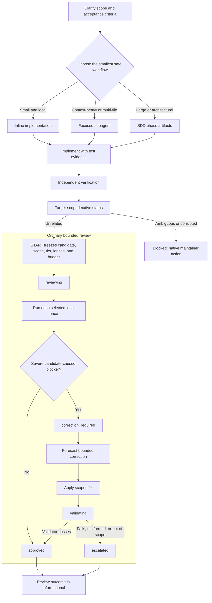

# README technical reference

This reference preserves the detailed installation, configuration, SDD/OpenSpec, runtime, and contributor material previously carried by the README. Start with the [README](../README.md) for the product overview; use this document when you need operational detail. Historical compatibility and authority passages remain reference material, not newly endorsed operator instructions.

## Navigation

- [Capabilities](#capability-reference)
- [Installation and release policy](#install)
- [SDD/OpenSpec and review architecture](#sddopenspec-flow)
- [Configuration, commands, skills, memory, and telemetry](#persona-modes)
- [Package contents and development](#package-contents)

## Capability reference

| Capability                     | What it does                                                                                                                                  |
| ------------------------------ | --------------------------------------------------------------------------------------------------------------------------------------------- |
| **el Gentleman persona**       | Makes Pi behave like a senior architect and teacher, not a generic chatbot. Spanish responses use Rioplatense voseo by default; neutral mode is saved globally with project overrides. |
| **Configurable startup intro** | Adds a rose/text-logo startup intro, compact runtime panel, color presets, and commands to hide or show the decorative parts.                  |
| **Work routing discipline**    | Small tasks stay inline. Context-heavy exploration can be delegated. Large or risky changes go through SDD/OpenSpec.                          |
| **SDD/OpenSpec assets**        | Installs phase agents and chains for `init`, `onboard`, `explore`, `proposal`, `spec`, `design`, `tasks`, `apply`, `verify`, `sync`, and `archive`. |
| **Lazy SDD preflight**         | Confirms SDD mode, artifact store, delivery strategy, and review budget on the first SDD invocation of every interactive session, including saved preferences; the parent transports the confirmed block to RPC SDD children.              |
| **Subagent orchestration**     | Keeps one parent session responsible while child agents explore, implement, test, or review with focused context.                             |
| **Strict TDD support**         | When project config declares a test command, apply/verify phases must record RED → GREEN → TRIANGULATE → REFACTOR evidence.                   |
| **Closed choice prompts** | Per-option hover/click/wheel in fullscreen; keyboard selection in either TUI mode. |
| **Native pointer regions** | Compose hover, press, click, and wheel behavior around public TUI components. |
| **Agent overlay close control** | Adds a header close button that adapts to available width. |
| **Reviewer protection**        | Surfaces review workload risk before a task turns into an oversized PR.                                                                       |
| **Per-agent model assignment** | Pi-native modal for assigning stronger or cheaper models to specific SDD/custom agents.                                                       |
| **Skill discovery registry**   | Maintains `.atl/skill-registry.md` from project and user skills so review/comment/PR workflows do not silently miss the right skill.          |
| **Skill creation workflow**    | Provides the `gentle-ai-skill-creator`/`gentle-ai-skill-improver` skills, `/skill-creation` prompt, and packaged style guide for LLM-first skills. |
| **Delivery skills**            | Includes issue-first PRs, chained PRs, work-unit commits, cognitive docs, comment writing, and Judgment Day review.                           |
| **Bounded native review**      | Freezes one candidate, dispatches only controller-selected lenses, and records native authority. Review outcomes are informational; delivery follows ordinary repository policy. |
| **Verified native runtime**    | The current source checkout provisions the exact package-local Gentle AI v2.8.2 runtime: signed, SHA-256-pinned release archives on Darwin/Linux and a Go SumDB-verified source build on Windows x64/arm64. It validates package-local integrity and rejects PATH, global, sibling, symlink, and mode fallbacks. |
| **Runtime safety**             | Blocks destructive shell commands, asks for confirmation for sensitive operations, and blocks direct read/write/edit access to sensitive paths. |

## Native pointer regions

Compose pointer behavior around public `Text`, `Box`, or custom content without making it a keyboard target:

```ts
const scope = createNativePointerScope();
const openInput = scope.wrap(new Text("Open input", 0, 0), {
  onClick: () => {
    openInputEditor();
    return { handled: true };
  },
});
const panel = new Container();
panel.addChild(openInput);
const observer = scope.createMouseObserver(() => tui.requestRender());
```

Pass `observer` around the root's native mouse dispatch; reuse `panel` as custom or overlay content.
Pointer input is fullscreen-only. Regions preserve a consuming child's native result and do not focus
`Text`, activate on press or wheel, synthesize outside leave events, or alter terminal tracking.
Callers own keyboard policy, theme state, and business actions.

**Migration note:** Do not enable `pi-tool-cards` and `quiet-tools` together: Pi rejects duplicate `bash`, `read`, `edit`, and `write` registrations. Disable or remove the standalone package during migration; gentle-pi does not change those package registrations or delete that repository. The global fullscreen setting described below is a separate install-time change.

## Install

```bash
pi install npm:gentle-pi@2.6.0
```

The stable release is [`v2.6.0`](https://github.com/Gentleman-Programming/gentle-pi/releases/tag/v2.6.0). Restart Pi after installation, then run `gentle-ai sync`. That published release pairs with Gentle AI `v2.8.0` and provider contract `1.2.0`; capabilities `v2.5` are retained. The command above installs that exact published version.

### Source checkout

This checkout prepares `gentle-pi` `2.6.2`; it is source state, not a published release. Its package-local native runtime pin is Gentle AI `v2.8.2`, distinct from the published `v2.6.0` pairing.

### Pi compatibility

The current package requires Pi 0.85.1 or newer (development tests pin 0.85.1). Use the latest Pi release; gentle-pi does not update your installed Pi automatically. Children, including any `GENTLE_PI_AGENTS_PI` override, must emit `agent_settled`: `agent_end` records a run's output but is not completion because retries or queued continuations may follow.

The [`v2.6.0` release](https://github.com/Gentleman-Programming/gentle-pi/releases/tag/v2.6.0) adds persistent registered worktrees and grouped `/gentle:changes` views; fuller workspace interaction details are in the [Gentle Shell reference](gentle-shell.md). It also adds named atomic `/gentle:profiles`, parent-confirmed native SDD preflight transport, native review intended-untracked selection and provider continuations, and opt-in custom ask responses. Pi recognizes its global Git-managed package path; subsystems install with explicit recovery guidance when npm lifecycle work was skipped. Windows keeps child consoles hidden and fixes ownership mode; Gentle Todo keeps the next pending task visible when collapsed.

### Install-time fullscreen

A successful postinstall in Pi's **global npm-managed** `agent-home/npm/node_modules/gentle-pi` or exact **global Pi Git-managed** `agent-home/git/github.com/Gentleman-Programming/gentle-pi` installation persists `"tuiMode": "fullscreen"` in `agent-home/settings.json`, preserving other settings. Agent home resolves through `GENTLE_PI_AGENT_HOME`, then `PI_CODING_AGENT_DIR`, then `~/.pi/agent`. Use `/settings` to switch back to regular; rerunning a recognized postinstall resets it to fullscreen. Existing project overrides still take precedence.

Project-local installs (`pi install -l`), Git installs outside that exact global Pi path, local-path installs, temporary packages, development checkouts, ordinary npm consumers, and pnpm symlink-store packages do **not** receive this change. Updates or installs that do not execute postinstall cannot reassert it; this is not a universal install/update guarantee or a change to historical releases.

Malformed/nonobject JSON, symlink/nonregular settings, unsafe paths, or a busy settings lock fail without replacing settings. The installer coordinates with Pi's cooperative settings lock and uses atomic replacement; it does not guarantee safety against noncooperating writers or malicious concurrent directory replacement. Already-fullscreen settings remain byte-identical. Native installation failure leaves settings untouched; `GENTLE_PI_SKIP_GENTLE_AI_INSTALL=1` skips only native provisioning, not the recognized global fullscreen setting.

### RDD history and opt-in

Native RDD was introduced in `gentle-pi` `v0.15.0` on 2026-07-10 with bounded review transactions. The current stable release, [`v2.6.0`](https://github.com/Gentleman-Programming/gentle-pi/releases/tag/v2.6.0), includes native RDD:

```bash
# Stable release
pi install npm:gentle-pi@2.6.0
```

RDD remains opt-in. Enable it only through an explicit user decision with `/gentle:review-mode enable`; `status` lets you inspect the mode without changing it.

The source checkout's RDD integration installs Gentle AI only into its private `.gentle-ai/` directory. Darwin and Linux use pinned release assets with asset and executable SHA-256 verification (signed archives for source pin `v2.8.2`; raw prerelease binaries only under a prerelease pin). Windows x64 and arm64 build the exact `v2.8.2` source tag with a local Go 1.25.10+ toolchain, a sealed Go environment, `GOTOOLCHAIN=local`, and `GOSUMDB=sum.golang.org`; it does not download Go automatically. Windows provenance is Go-toolchain plus SumDB evidence and postinstall tamper detection, **not** Authenticode or protection against a malicious joint binary-and-manifest replacement. Package-private locks coordinate cooperative concurrent or crashed installers; their tombstones fail closed. A malicious same-user process with write access to package-private `node_modules` is outside that protocol because it can already replace package code, binary, or manifest, and portable Node has no pathname-delete CAS. It never uses `PATH` or a global `gentle-ai` installation. For development or offline installs only, set `GENTLE_PI_SKIP_GENTLE_AI_INSTALL=1`; native review operations then fail closed with an actionable `package-local-binary-missing` error. To recover explicitly, if `GENTLE_PI_SKIP_GENTLE_AI_INSTALL` is set, remove or unset it before changing to the installed `gentle-pi` package directory. Then run `node scripts/install-gentle-ai.mjs`. This invokes the package-owned installer without relying on a global binary or npm configuration change. A missing binary can result from skipped lifecycle scripts, but does not prove that lifecycle scripts were disabled.

Recommended companion packages:

```bash
pi install npm:pi-intercom
pi install npm:gentle-engram
pi install npm:pi-web-access
pi install npm:pi-lens
pi install npm:@juicesharp/rpiv-ask-user-question
```

Then start Pi in a project:

```bash
pi
```

`gentle-pi` installs delegation and review agents at startup. SDD agents, chains, and support are global Pi runtime assets installed on demand, not per-project setup. The first SDD flow in a session runs a one-time SDD preflight for preferences and managed-asset refresh; for natural-language requests, el Gentleman decides when SDD is needed and runs the explicit preflight first.

## Quick start

```text
/gentle:status          Check package, SDD assets, OpenSpec, and global model config.
/gentle:doctor          Run read-only diagnostics for SDD assets, config, tools, and guards.
/gentle:sdd-preflight   Run or reuse the session SDD preflight explicitly.
/gentle-sdd-init           Create or refresh openspec/config.yaml (openspec/both stores only).
/gentle:models             Assign global model/effort routing to SDD/custom agents.
/gentle:profiles           Create, switch, and manage global agent-model profiles.
/gentle:persona            Switch between gentleman and neutral persona modes.
/gentle:background-subagents  Show or set the managed background-subagents policy, with its deciding source.
/gentle:review-mode          Show or set the receipt-driven development mode (status|enable|disable).
/gentle:banner             Configure startup rose, text logo, and color preset.
```

Typical flow:

1. Open Pi in your repo.
2. Run `/gentle:status`.
3. Run `/gentle-sdd-init` once per project, or when test/project capabilities change. This also runs the session SDD preflight.
4. For a substantial change, ask Pi to use SDD. Natural-language requests are classified by the parent agent, not by brittle runtime regexes.
5. Review the phase artifacts instead of trusting floating chat context.

## Core workflow

1. **Install and inspect.** Install `gentle-pi`, open Pi in the target repository, then run `/gentle:status` or `/gentle:doctor`.
2. **Plan when risk justifies it.** Small work stays direct; substantial work uses SDD with Engram, OpenSpec, or both so requirements and decisions survive compaction.
3. **Build with evidence.** One focused writer implements the approved scope. When Strict TDD is available, apply and verify preserve RED → GREEN → TRIANGULATE → REFACTOR evidence.
4. **Use runtime-owned RDD when available.** Gentle AI supplies any runtime-specific review instructions; this package does not recreate a lifecycle in documentation or prompts.
5. **Deliver through ordinary repository policy.** Review and Judgment Day evidence is informational only; Pi never creates a delivery route, authorization, target rederivation, or receipt gate.

> **Trust what the system can derive, not what an agent claims.** Agents analyze the candidate. The package-local Gentle AI runtime owns scope, risk, findings, and review authority. Review outcomes inform delivery; ordinary repository policy decides delivery commands. Dangerous-command safety and destructive-review consent remain independent. See Gentle AI's [review authority threat model](https://github.com/Gentleman-Programming/gentle-ai/blob/main/docs/review-authority-threat-model.md) and [Chapter 21 — Verifiable Trust](https://the-amazing-gentleman-programming-book.vercel.app/en/book/Chapter21_Verifiable-Trust).

## How the harness decides what to do

`gentle-pi` routes through the smallest safe workflow:

| Request shape                                                               | Harness                      |
| --------------------------------------------------------------------------- | ---------------------------- |
| Small, clear, local edit                                                    | Inline direct work.          |
| Unknown codebase area or context-heavy investigation                        | Focused subagent delegation. |
| Large, ambiguous, architectural, product-facing, or high-review-risk change | SDD/OpenSpec flow.           |

The goal is not ceremony. The goal is to avoid accidental chaos. Once a task stops being small, delegation is mandatory.

### Delegation triggers

`gentle-pi` keeps the parent session thin and delegates at the narrowest useful point. When the Pi Subagents extension is installed, the preferred runtime is the `subagent_*` tool family because it runs the user's configured project/global subagent definitions and preserves history/background behavior. With the background policy on, delegations default to background mode: the terminal stays free and each result comes back as a message that starts a new turn; task mode is reserved for delegations that must ask the user something mid-flight. If those tools are unavailable, the parent should fall back to Pi's native `Agent` tool or another available delegation mechanism. The requirement is delegation; the runtime is capability-dependent.

| Trigger                                                                                                                     | Required behavior                                                             |
| --------------------------------------------------------------------------------------------------------------------------- | ----------------------------------------------------------------------------- |
| Reading 4+ files to understand a flow                                                                                       | Launch `scout`, `context-builder`, or the closest read-only mapping subagent. |
| Touching 2+ non-trivial code files                                                                                          | Delegate one writer; do not continue inline unless delegation is unavailable. |
| Commit, push, or PR after code changes                                                                                      | Follow the loaded native instruction, or ordinary repository policy when none is supplied. |
| Wrong cwd, worktree/git accident, merge recovery, confusing test/env issue                                                  | Stop, preserve the affected scope, and investigate separately before resuming. |
| Long monolithic session with accumulating complexity, roughly 20 tool calls, 5 exploratory reads, or 2 non-mechanical edits | Pause and delegate the remaining work, or stop and explain the exact blocker. |

The intended balanced loop for a bounded bugfix is:

```text
parent git/status + clarify → one worker writes authorized fixes → focused verification → parent reports
```

`scout`/`context-builder` save parent context by compressing broad exploration. `worker` preserves a single writer thread. Any RDD-specific actor behavior belongs to the runtime instruction supplied by Gentle AI, not to this README.

### Review authority recovery and reset safety

Legacy pre-graph authority is never migrated. `gentle_review inspect` reports an exact repository-bound destructive reset challenge for legacy corruption; after that fresh interactive authorization, RESET and RECOVER_LOCK route to the audited native `gentle-ai review reclaim` operation and RECOVER routes to native `gentle-ai review recover`, so every destructive transition is executed and audited by the native authority store. Native inputs the request did not carry return a `native-input-required` envelope instead of being invented. Existing graph-v1 ordinary lineages remain readable and gate-validatable but are read-only; Judgment Day remains mutable on graph-v1.

`gentle_review abandon`, `quarantine-legacy`, and `reconcile-authority` remain explicit v2.1.11 maintenance routes. Pi derives and displays the published nine-line `gentle-ai.review-abandon-authorization/v2` binding only for a caller-specified compact lineage, revision, snapshot identity, and discarded-work summary (captured lens results, findings presence, evidence-record presence); the native CLI re-derives non-terminal compact-v2 eligibility and the exact discarded work before accepting it. Legacy quarantine accepts only `historical findings freeze changed unrelated transaction state` with disposition `quarantine-malformed-freeze-event` and uses its exact eight-line binding. Both require fresh interactive approval and fail closed headlessly.

`gentle_review reconcile-authority` accepts one predecessor lineage and revision, one successor lineage and revision, an actor, and a reason. Pi derives the exact seven-line `gentle-ai.review-reconcile-authorization/v1` binding, or appends exactly `anomalies=unchanged_target,malformed_recovery_authorization` for the published dual anomaly in that order. Native code re-derives every anomaly; malformed bindings, changed revisions, unavailable native support, cancellation, and native refusal fail closed through typed envelopes.

Reconciliation is intentionally narrow: native code may quarantine only the bound invalid compact-v2 recovery successor and persists the returned audit record; the predecessor stays untouched. Pi never recreates the retired `prepare-supersession`/`supersede` authority writer and never falls back to RESET or RECOVER.

`gentle_review repair-legacy-alias` is the sole v2.1.11 route for `unsupported historical v1 operation alias`. The model supplies only lineage, actor, and reason. Pi freshly reads the native inventory, derives the canonical repository, exact legacy revision, fixed diagnostic, and fixed `quarantine-approved-historical-alias` disposition, displays the LF-only eight-line binding, and requires a new interactive approval. Native re-derives eligibility and quarantines rather than rewriting or validating the historical chain.

`review dispose-result` is deliberately unsupported by Pi pending a separate design; it has no controller operation or fallback. All maintenance routes fail closed headlessly and never auto-run against legacy history.

Native lifecycle status remains informational. VALIDATE does not authorize delivery; commit, push, PR, and release commands follow ordinary repository policy. Recovery grants no new budget, and legacy graph bundle export/import is retired.

This is the post-U8 boundary, not the final architecture. [Issue #191](https://github.com/Gentleman-Programming/gentle-pi/issues/191) is the immediate final unit in this same delivery: extract the remaining Pi command-projection and lifecycle-gate surface from `review-transaction.ts`, repoint runtime enforcement, then delete only dependencies proven unreachable without weakening graph-v1 Judgment Day. The branch-wide High-tier 4R runs after that extraction, before the single size-exception PR.

### Review Lens Selection (architecture reference)

`reviewer` is not an installed subagent name. It is historical routing vocabulary, not a static instruction. When a runtime-specific Gentle AI instruction applies, it alone determines whether any concrete lens is used:

| Context | Review lens |
| --- | --- |
| Clear naming, structure, maintainability, small refactors | `review-readability` |
| Behavior, state, tests, determinism, regressions | `review-reliability` |
| Shell/process integration, partial failures, recovery, degraded dependencies | `review-resilience` |
| Security, permissions, data exposure/loss, architecture, dependencies | `review-risk` |
| Large PR, hot path, or >400 changed lines | Full 4R: `review-risk`, `review-resilience`, `review-readability`, `review-reliability` |

The former compact controller classified documentation/comment/formatting-only changes as zero-lens, standard changes as one dominant lens, and higher-risk paths as full 4R. This describes compatibility architecture only; never derive or run those choices from this README.

### Review authority architecture (reference only)

Gentle AI dynamically supplies runtime-specific RDD instructions. `gentle-pi` does not define an RDD lifecycle, command route, approval path, recovery sequence, or fallback. The historical compact-controller material below documents architecture and compatibility boundaries only; it is not an operator instruction.

Concretely: `gentle-pi` mirrors the Gentle AI provider contract bundle's `orchestration/pi.md` locally (`contracts/review-provider-contract-mirror/`, verified against the mirror lock's recorded SHA-256 before injection) and injects that mirrored text into the primary session's system prompt at session start. Gentle AI does not write anything into Pi's system prompt; when the mirrored contract is absent, unreadable, or fails digest verification, `gentle-pi` invents no fallback lifecycle.



VALIDATE is informational. Commit, push, PR, and release commands follow ordinary repository policy; RDD never authorizes, rewrites, consumes review state for, or blocks them. Dangerous-command safety and destructive-review consent remain independent.

For the source checkout, native contract pairing is exact: this adapter resolves only the integrity-verified package-local Gentle AI v2.8.2 executable, independently hashes it, then negotiates `gentle-ai.review-integration/v2` outside the repository. Capabilities are cached by that executable digest. Every START, target status, FINALIZE, validate, and BIND-SDD request passes the same contract identifier. Negotiated envelopes decode exactly against the vendored schemas; `recover` routes only the provider-selected `action_disposition`, and optional additions require a future compatible schema/minor that the provider explicitly advertises and the consumer negotiates.

Contract `/v2` replaces the Base64 `candidate_diff` reviewer transport of `/v1` with immutable `base_tree`/`candidate_tree` plus an ordered `changed_path_manifest` and never an inline patch. `gentle-pi` negotiates `/v2` only, with no dual-lane fallback; the cutover landed as one atomic commit against gentle-ai v2.2.2 (tracked by the `migrate-review-integration-v2` change), and the `/v1` schemas stay packaged because the `/v2` schemas `$ref` into their fragments. This provider contract version is unrelated to Pi's own internal "compact-v2" review-authority naming used below — the shared digit is coincidental, not a version pairing.

Target status owns `current_target`, `unrelated`, `ambiguous`, and `corrupted` applicability and returns one native action. Pi does not reconstruct ordinary authority from provider-private files or choose a lineage from repository-wide history. Restart recovery rebuilds only the derived candidate view from the native Git/content projection, including intended-untracked paths, symlinks, and immutable gitlink identities. Native failure envelopes retain their exact mutation outcome, replayability, required inputs, request digest, and next action. After an unknown or lost mutating result, Pi calls target status before any replay decision and returns only the provider-declared action.

Once the source checkout's pinned gentle-ai runtime (currently v2.8.2) has written review authority, rollback MUST preserve every native store and receipt and MUST NOT run a downgraded binary against that repository. Disable the Pi route or roll forward to a compatible authority-aware release instead; deleting authority data or reinstalling an older binary is not a rollback path.

### FINALIZE wrapper input

`gentle_review` accepts `input` as a JSON-serialized object string. For initial results, provide `review_result.lens_results[]`; each selected lens appears exactly once with `lens`, `findings`, and non-empty `evidence`. A clean lens uses `findings: []`. Pair `final_evidence` with exactly one of `final_verification_passed` or `final_verification_outcome`.

```json
{
  "review_result": {
    "lens_results": [
      {
        "lens": "review-reliability",
        "findings": [],
        "evidence": ["complete candidate reviewed"]
      }
    ]
  }
}
```

This is the Pi wrapper contract, not the native CLI file contract. The native command receives separate `--result`, `--refuter`, `--validation`, and `--evidence` files from the wrapper.

START derives the complete Git/untracked snapshot, lineage, persisted `low | medium | high` tier, zero/one/four lenses, authored changed lines, and correction budget `min(200, ceil(original_changed_lines / 2))`. Generated `testdata/golden/**` stays in snapshot identity but does not count as authored risk lines.

`gentle_review inspect` may stop pre-lineage on the intended-untracked selection, and that stop names its own continuation in `nextStep`. The stop's `expected_untracked_inventory` digest covers untracked path names only (`git ls-files --others --exclude-standard`); nothing is read or hashed at inventory time, and file content is hashed only for the paths actually selected, at candidate freeze. Resolve the stop either with `select-intended-untracked` (empty `intendedUntracked` excludes every eligible path; a subset includes only those paths) or in one call by passing `untrackedScope` to `inspect`: use `"exclude"` without `intendedUntracked`, or `"select"` with it. The retained selection is bound to the resolved native target/candidate and is adopted only by a matching plain START; a fresh inspect invalidates an older pre-lineage selection. To keep a path out of the inventory permanently, ignore it through `.gitignore` or `.git/info/exclude`.

Every finding requires `evidence_class`, `causal_disposition`, and concrete changed-hunk, candidate-created-path, differential-test, or before/after proof. Missing IDs are assigned natively and selected-lens results are canonicalized deterministically.

Actor output is untrusted data and cannot authorize transitions, fixes, receipts, gates, or delivery.

Only severe `introduced`, `behavior-activated`, or `worsened` findings with valid proof enter correction IDs. `pre-existing` and `base-only` become follow-ups; `unknown`, insufficient, malformed, or inconclusive severe claims escalate. WARNING and SUGGESTION are informational.

Deterministic blockers need no refuter. Inferential blockers use exactly one complete read-only refuter batch.

Refuter proof may be independent concrete reproduction evidence; it does not need to duplicate reviewer `proof_refs`. Invalid, empty, malformed, missing, duplicate, unknown, or inconclusive refuter output escalates without a replacement refuter.

When native IDs are assigned to inferential findings, the first FINALIZE returns their canonical rows and a content-derived request hash without mutation; the second replays identical lens input with that hash and one complete refuter batch.

Ordinary permits one correction transaction within the original budget. FINALIZE requires a positive forecast before editing and derives actual correction lines from Git; one targeted validator and final verification close that transaction. Initial lenses are never rerun, while frozen findings and genesis scope remain unchanged.

The validator checks original criteria and correction regression only and cannot add scope or findings. Final evidence is hashed during FINALIZE, never at START.

Compact ordinary has five states: `reviewing`, `correction_required`, `validating`, `approved`, and `escalated`.

The validator cannot change claims, add findings, request fixes, launch actors, or request another attempt. A failed correction escalates instead of opening another review budget.

Compact authority uses content-derived CAS under the Git common directory. Exact retries are idempotent; stale/semantic retries, terminal mutation, and same-lineage graph-v1/compact-v2 ambiguity fail closed.

Trust boundary: The local orchestrator and same-user process are trusted to execute selected actors and submit their exact outputs. Native code owns scope, risk, IDs, canonicalization, state, receipts, and gates, and rejects malformed or inconsistent results structurally and causally. Malicious same-user host/process authenticity is a non-goal because that actor can replace the extension or mutate local authority; externally trusted attestation would require a separately privileged signer/service and is not claimed.

Ordinary ends only as `approved` or `escalated`.

Judgment Day starts only when explicitly requested and replaces ordinary review for that lineage.

Judgment Day starts with exactly two blind judges and zero refuters.

Judgment Day alone may iterate discovery and scoped re-judgment, for at most two rounds.

Findings surviving round two escalate; no third-round transition exists.

Native review mode and the two candidate choices remain provider-owned lifecycle semantics. For a validated `consent/v3` envelope in the interactive parent TUI, Pi displays those two choices unchanged and adds a clearly separate host-owned action: **Run this review and allow reviews for this Pi session**. Only direct human selection creates this process-memory grant. Its scope is the coordinating live SessionManager session and the canonical Git common-directory identity of the selected repository: it runs the current envelope's exact provider `granted` invocation through the existing one-shot `answer-consent` path, then does the same for later fresh validated envelopes in sibling worktrees of that same clone, including package-owned children. An unrelated repository requires a separate explicit human grant. Reload preserves it; `/tree` retains it; revoke removes the current repository grant; quit, new, resume, fork, or process restart removes all session grants. The command's `status` action reports the in-memory state without changing provider mode or authority.

The host grant is held only in a schema-checked `globalThis[Symbol.for(...)]` WeakMap registry keyed by session and canonical Git common-directory digest. It is never written through session entries, settings, environment variables, or the old asked latch. A package-owned Gentle Agents child can request one bounded parent-owned stdio authorization for its own validated pending ordinary START; it sends only that target's canonical repository digest, and the parent rechecks the live task, digest, and current parent session grant before the child replays its exact provider grant locally. No candidate bytes, provider vectors, paths, local child grant, or delivery authority crosses that channel. External or legacy `pi-subagents` launchers do not receive this channel and remain unsupported. Headless/RPC/unsupported UI, external processes, model prose, tool arguments, cancellation, identity drift, malformed identity, and uncertain native results cannot create or consume the grant. Native workspace binding remains canonical and target-specific; session-wide consent never authorizes an unselected target or an unrelated repository. The grant conveys no review verdict, forecast/cost approval, acknowledgement, maintenance, delivery, or cross-repository authority. When the host cannot resolve the choice, `gentle_review` returns the original unresolved two-choice provider envelope unchanged for the normal lossless relay. SessionManager binding isolates simultaneous SDK sessions; Pi does not claim universal same-process agent-principal isolation because the SDK exposes no principal identity.

When RDD is on and an agent loop ends with an unreviewed candidate, `gentle-pi` sends one read-only reminder pointing the agent back to `gentle_review {"operation":"inspect"}` before it reports completion. This nudge is idempotent (at most once per target identity per session), never fires for a headless session or a subagent's own loop, and never runs START or answers consent itself. Pi treats a child `agent_end` as a latest-answer update, not completion: queued retry, compaction, follow-up, required verification, and legitimate post-correction verification remain live until `agent_settled`. It does not claim ready or RDD-ready first, but this ordering rule does not impose a universal full-suite requirement or turn a receipt into a delivery gate. At session start, `gentle-pi` records the current target identity as a baseline, so a candidate that already existed before the session began (the user's own prior work, not this session's output) never draws the reminder.

Review outcomes and receipt state are informational; commit, push, pull-request, and release delivery follow ordinary repository policy. No one-shot command authorization, publication-target revalidation, or receipt gate is required for delivery, and Pi does not inspect RDD mode or native authority to decide a Bash delivery command.

Dangerous-command safety remains independent and authoritative. Destructive-review-maintenance consent remains separate from delivery. Review operations, informational VALIDATE, and SDD perform no commit, push, pull-request, release, or publication operation.

The Pi host relay bounds each locked-down reviewer subprocess by materialized prompt size rather than by one fixed number: a 15-minute floor plus 15 minutes per mebibyte of prompt, clamped to a 2-hour ceiling. Set `GENTLE_PI_REVIEW_RELAY_PI_TIMEOUT_MS` to a positive decimal to replace that derived bound with your own; malformed values are ignored and the same 2-hour ceiling still applies, so no configuration turns a foreground finalize into an unbounded child process. A reviewer killed by the bound reports `pi-host-relay-timeout` with the elapsed time and the limit it was measured against, and it explicitly does not ask you to relaunch the identical slot — that would re-spend the model tokens to reach the same wall. Reviewer results admitted earlier in the same finalize stay admitted and are not re-run.

Adversarial review roles (the refuter and the targeted validator) are never Pi-authored: the provider renders self-contained `review.capture-refuter` / `review.capture-validation` vectors and Go runs its own locked-down `pi` process on them. Package agent assets remain a package-managed isolated installation. Project and user overrides may shadow a package asset; `gentle-pi` preserves those definitions and does not claim their effective permissions are package-compliant.

## SDD/OpenSpec flow

```text
init
  ↓
explore → research (optional) → proposal → spec ─┬→ design ─┐
                                                  └─────────┴→ tasks → apply → verify → sync → archive
```

The main loop is intentionally file-backed when you choose `openspec` or `both`:

```text
planning artifacts                implementation evidence        canonical update
──────────────────                ───────────────────────        ────────────────
proposal/spec/design/tasks   →    apply-progress/verify-report → sync-report → archive-report
```

For substantial work, the parent session coordinates the flow and each phase writes artifacts. That gives you:

- explicit requirements and non-goals;
- design decisions that survive compaction;
- task plans reviewers can reason about;
- implementation evidence;
- verification reports;
- sync reports that update canonical specs while keeping the change active;
- archive notes for future agents.

### OpenSpec artifact model

`gentle-pi` treats OpenSpec-compatible behavior as part of the harness. You do not need to install the external OpenSpec CLI/package for SDD.

In file-backed modes, canonical accepted behavior lives in `openspec/specs/`, while active changes carry deltas under `openspec/changes/`:

```text
openspec/
├── specs/                                      # accepted source of truth
│   └── {domain}/spec.md
└── changes/
    ├── {change}/                              # active work
    │   ├── proposal.md
    │   ├── specs/{domain}/spec.md             # full spec or delta spec
    │   ├── design.md
    │   ├── tasks.md
    │   ├── apply-progress.md
    │   ├── verify-report.md
    │   └── sync-report.md
    └── archive/YYYY-MM-DD-{change}/           # immutable audit trail
```

Delta flow:

```text
openspec/changes/{change}/specs/{domain}/spec.md
        │
        │  sdd-sync applies ADDED / MODIFIED / REMOVED
        ▼
openspec/specs/{domain}/spec.md
        │
        │  sdd-archive moves the completed change folder
        ▼
openspec/changes/archive/YYYY-MM-DD-{change}/
```

When a canonical spec already exists, change specs use requirement operation sections:

```markdown
## ADDED Requirements

## MODIFIED Requirements

## REMOVED Requirements
```

`MODIFIED` requirements must include the full requirement block, including still-valid scenarios, because sync replaces the canonical block by requirement name. `sdd-sync` syncs file-backed deltas into `openspec/specs/{domain}/spec.md` while keeping the change active; `sdd-archive` then moves the synced change to `openspec/changes/archive/YYYY-MM-DD-{change}/`.

Engram-only mode is different by design: Engram is working memory and does not maintain a canonical spec merge layer. Use `openspec` or `both` (hybrid file + memory persistence) when you need canonical spec evolution.

## SDD preflight and project files

`gentle-pi` does not require SDD agents to be copied into every project. The package installs and refreshes global Pi SDD assets under the Pi agent home on SDD activation, and treats project-local files only as overrides/debug copies. Slash SDD flows such as `/sdd-*`, `/gentle-sdd-init`, and the explicit `/gentle:sdd-preflight` command run a lazy preflight and resolve session-scoped SDD preferences. For natural-language requests, the parent agent decides whether the work should use SDD and must run/reuse `/gentle:sdd-preflight` before continuing.

```text
~/.pi/agent/agents/sdd-*.md
~/.pi/agent/chains/sdd-*.chain.md
~/.pi/agent/gentle-ai/support/strict-tdd*.md
```

Every new interactive session confirms preflight on its first SDD invocation. Saved preferences and canonical defaults are suggestions: confirm the grouped values or change them. Cancellation leaves preflight unresolved. The parent `subagent_run` boundary enforces this before every shipped SDD child and prepends the exact rendered `## SDD Session Preflight` block through its existing `context`; RPC children consume it and never originate or persist defaults. Missing or malformed transport blocks before spawn. Only a safely distinguishable standalone headless parent retains silent defaults. Session confirmation does not reset project initialization: the cold-start order remains confirmation → `sdd-init` → explore.

Canonical values are `auto` execution mode, `openspec` artifact store, `ask-on-risk` delivery strategy, and a `400` changed-line review threshold. The delivery strategy domain is `ask-on-risk`, `auto-chain`, `single-pr`, or `exception-ok`; `chain_strategy` remains deferred until chaining is selected. `exception-ok` requires explicit `size:exception` acceptance and is never inferred. Consent, authorization, security, destructive/publishing, interactive phase approval, and ambiguous-scope gates remain human-controlled.

Startup refreshes only hash-proven delegation and review assets; existing SDD package content is preserved until SDD preflight or an explicit SDD installation command. For the previously unowned `sdd-research.md`, SDD refresh recognizes only the known old content hash (ignoring model/thinking routing), preserves routing, and records ownership. Body-edited or unknown assets remain untouched. Manual refresh uses the same ownership checks, scoped to the selected owner:

```text
/gentle:install-delegation --force
/gentle:install-review --force
/gentle:install-sdd --force
```

SDD preflight (including `/gentle-sdd-init`) installs missing SDD agents, chains, and support files and refreshes hash-proven managed SDD copies only. It preserves user edits and project overrides. Applying explicit saved model settings remains a separate, global concern at startup and preflight; the three installer commands do not apply model settings.

### Selected research

Research capabilities use an explicit package mapping intersected with active Pi tools and the agent's allowlist. Official documentation requires only `fetch_content`; open-web requires all four tools: `web_search`, `source_check`, `fetch_content`, and `get_search_content`. Each must be active and approved/reachable in the child; none is optional. Inventory admission does not prove execution or source-backed evidence. The child receives exact registered names through `--tools` and rechecks its local inventory. SDK-only parent tools are not inherited by a CLI child.

Generic MCP and dynamic namespace gateways (including `mcp__context7`) are not method-scoped grants. Context7-only installations remain unavailable through those gateways until a narrow verified route exists; this does not disable supported direct web tools. Explicit source restrictions always apply. Selected supported research must run and record auditable source-backed claims; any selected unavailable or partial class blocks proposal readiness. Bash and invented citations are never fallbacks.

This downstream mapping implements the exact Pi grants defined by merged [Gentle AI PR #4420](https://github.com/Gentleman-Programming/gentle-ai/pull/4420) for gentle-ai#3846 and gentle-pi#471. Research admission is enforced locally against active child tools, not through the pinned native binary, so this change does not require a native release or re-pin. The opt-in live integration test verifies actual child tool execution and a source-backed passage independently of inventory checks.

Workspace edits do not activate a different installed package path. Activate the updated package separately before expecting these behaviors in new sessions; edited installed assets may still need an explicit human reconciliation.

Manual preflight command:

```text
/gentle:sdd-preflight
```

## Skill registry

`gentle-pi` keeps a local registry at:

```text
.atl/skill-registry.md
```

The registry scans project and user skill roots, not package-owned skills. It exists to catch workflow skills that are present on disk but not visible in Pi's injected skill list.

It scans common roots such as:

```text
./skills
.opencode/skills
.claude/skills
.gemini/skills
.cursor/skills
.github/skills
.codex/skills
.qwen/skills
.kiro/skills
.openclaw/skills
.pi/skills
.agent/skills
.agents/skills
.atl/skills
~/.pi/agent/skills
~/.config/agents/skills
~/.agents/skills
~/.kimi/skills
~/.config/opencode/skills
~/.config/kilo/skills
~/.claude/skills
~/.gemini/skills
~/.gemini/antigravity/skills
~/.cursor/skills
~/.copilot/skills
~/.codex/skills
~/.codeium/windsurf/skills
~/.qwen/skills
~/.kiro/skills
~/.openclaw/skills
```

Behavior:

- `.atl/` is added to `.gitignore` when needed;
- the registry refreshes on session start;
- startup refresh is skipped when Pi starts with `--no-skills` / `-ns`, `--no-skill-registry`, or `GENTLE_PI_NO_SKILL_REGISTRY=1`;
- `/skill-registry:refresh` forces regeneration;
- a best-effort watcher refreshes when skill files change;
- the registry indexes skill names, full descriptions, scope, and exact `SKILL.md` paths without copying skill body rules.

Skill discovery is a guardrail, not a workflow router: it helps Pi load the right skill without forcing extra ceremony.

`gentle-pi` also ships package-owned `gentle-ai-skill-creator` and `gentle-ai-skill-improver` skills plus the `/skill-creation` prompt for creating or updating project skills. Both skills use `docs/skill-style-guide.md` as their normative style contract. The workflow checks for duplicates, keeps `SKILL.md` concise, uses one-line trigger-rich frontmatter, and reminds maintainers to refresh the registry after skill changes.

Packaged skills include `cognitive-doc-design`, `comment-writer`, `gentle-ai-judgment-day`, `gentle-ai-skill-creator`, `gentle-ai-skill-improver`, and the other delivery/review skills under `skills/`. SDD init is installed as the packaged `sdd-init` runtime agent under `assets/agents/` and refreshed with the SDD assets.

Compatibility: the package keeps the existing skill folders (`skills/branch-pr`, `skills/cognitive-doc-design`, `skills/comment-writer`, `skills/judgment-day`, `skills/skill-creator`, `skills/skill-registry`, and `skills/work-unit-commits`) but their exported frontmatter names are prefixed to avoid collisions with user/global skills. Treat former package names such as `branch-pr`, `cognitive-doc-design`, `comment-writer`, `judgment-day`, `skill-creator`, `skill-registry`, and `work-unit-commits` as legacy aliases in prose; runtime skill selection should use `gentle-ai-branch-pr`, `gentle-ai-cognitive-doc-design`, `gentle-ai-comment-writer`, `gentle-ai-judgment-day`, `gentle-ai-skill-creator`, `gentle-ai-skill-registry`, and `gentle-ai-work-unit-commits`.

Delegation contract:

- parent/orchestrator resolves project/user skills from the registry and passes matching paths under `## Skills to load before work`;
- SDD subagents still use their assigned executor/phase skill;
- during normal runtime, subagents should not independently discover additional project/user `SKILL.md` files or the registry;
- fallback loading is degraded self-healing and must be reported via `skill_resolution` as `fallback-registry`, `fallback-path`, or `none`.

## Persona modes

```text
/gentle:persona
```

| Persona     | Behavior                                                                                                      |
| ----------- | ------------------------------------------------------------------------------------------------------------- |
| `gentleman` | Senior architect, teacher, direct technical feedback, Rioplatense Spanish/voseo when the user writes Spanish. |
| `neutral`   | Same discipline, warmer professional language, no regional expression.                                        |

Saved globally at:

```text
~/.pi/gentle-ai/persona.json
```

A project can still override the global default with:

```text
.pi/gentle-ai/persona.json
```

`/gentle:persona` writes the global config and updates an existing project override when one is present, so the current project does not stay stale. Run `/reload` or start a new Pi session after switching persona.

## Model and effort assignment

```text
/gentle:models
```

The modal discovers:

- project agents in `.pi/subagents/`, `.pi/agents/`, and `.agents/`;
- user agents in `~/.pi/agent/subagents/`, `~/.pi/agent/agents/`, and `~/.agents/`.

When applying routing, project agents write runtime profiles to `.pi/subagents.json`; global and built-in agents write profiles to `~/.pi/agent/subagents.json`.

Recommended model/effort shape:

| Agent kind                 | Recommended model                                    | Recommended effort (`thinking`) |
| -------------------------- | ---------------------------------------------------- | ------------------------------- |
| Explore, proposal, archive | Fast and cheap is usually enough.                    | `off` to `low`                  |
| Spec, design, tasks        | Strong reasoning model.                              | `medium` to `high`              |
| Apply                      | Strong coding and tool-use model.                    | `medium` to `high`              |
| Verify / review            | Strong fresh-context model.                          | `high`                          |
| Tiny utilities             | Inherit active/default model unless they bottleneck. | `inherit`                       |

Saved globally at:

```text
~/.pi/gentle-ai/models.json
```

Existing project-local `.pi/gentle-ai/models.json` files are still read as a legacy fallback when no global model config exists, but `/gentle:models` writes the shared global config.

Inside `/gentle:models`, press `x` to export the saved routing to `~/.pi/gentle-ai/models.export.json`, or `r` to restore from that file after confirmation. Export uses a versioned envelope and restore writes the normal `models.json` shape before applying routing to agents.

Config shape (per agent):

```json
{
  "sdd-design": {
    "model": "anthropic/claude-sonnet-4",
    "thinking": "high"
  },
  "sdd-archive": {
    "model": "openai/gpt-5-mini"
  }
}
```

Legacy string entries are still accepted and treated as `model`-only config.

## Agent-model profiles

```text
/gentle:profiles
```

Profiles are named, switchable snapshots of the global agent-model routing from `/gentle:models`. The panel fills the terminal, shows the profile list on the left, and a detail pane comparing the selected profile's routing with the currently effective routing, one line per agent in shared columns. Keys:

| Key     | Action                                                                 |
| ------- | ---------------------------------------------------------------------- |
| `enter` | Apply the selected profile live (writes `models.json`, reconciles agents, sets the orchestrator when the profile defines one). |
| `c`     | Create a new, empty profile.                                           |
| `s`     | Update the selected profile from the current routing (including the orchestrator currently set in `settings.json`). |
| `d`     | Duplicate the selected profile.                                        |
| `r`     | Rename the selected profile (keeps it active if it was active).        |
| `x`     | Delete the selected profile (refuses the active profile).              |
| `e`     | Export the selected profile to `~/.pi/gentle-ai/profiles.export.json`. |
| `i`     | Import a profile from `~/.pi/gentle-ai/profiles.export.json`.          |
| `j`/`k`, wheel | Scroll the detail pane one line at a time (agents-view style).                                |
| `pgup`/`pgdn`, `ctrl+j`/`ctrl+k` | Scroll the detail pane by a page.                                |
| `esc`   | Close.                                                                 |

Applying a profile writes `~/.pi/gentle-ai/models.json`, then reconciles agent frontmatter and `subagents.json` the same way `/gentle:models` does. The reconciliation happens on the next subagent launch, and that launch still routes with the previous routing — expect one launch of lag after switching. The active profile is persisted so `/gentle:profiles` reopens with the applied profile marked.

A profile also carries the orchestrator under the reserved routing key `orchestrator`. Applying a profile that defines it writes `defaultProvider`, `defaultModel`, and `defaultThinkingLevel` to Pi's global `settings.json` (preserving every other key; an unreadable `settings.json` aborts that part and is reported instead of being overwritten). Applying a profile without an `orchestrator` entry never moves the orchestrator, and `s` snapshots the currently effective orchestrator together with the routing. `orchestrator` is reserved: it is not a subagent name, is never written to `subagents.json`, and is not counted as a role.

When `profiles.json` is missing, the command seeds one profile named `current` captured from the existing `models.json`, marked active only when `models.json` has routing entries. Profiles or routing entries dropped by normalization are named in a warning instead of being lost silently.

Saved globally at:

```text
~/.pi/gentle-ai/profiles.json
```

Store shape:

```json
{
  "kind": "gentle-pi.agent_model_profiles",
  "version": 1,
  "active": "deep-work",
  "profiles": {
    "deep-work": {
      "orchestrator": {
        "model": "anthropic/claude-sonnet-4",
        "thinking": "high"
      },
      "sdd-design": {
        "model": "anthropic/claude-sonnet-4",
        "thinking": "high"
      }
    },
    "current": {}
  }
}
```

The `profiles` values use the same per-agent shape as `models.json`. Profile names are slugs of 1-64 ASCII characters (letters, numbers, `.`, `_`, `-`, starting with a letter or number); names outside ASCII are rejected, as are the reserved object keys `__proto__`, `constructor`, and `prototype`. A rename or duplicate onto an existing name is refused, renaming the active profile keeps it active, and deleting the active profile is refused. Export and import use a single-profile envelope (`kind: "gentle-pi.agent_model_profile"`, `version: 1`) at `~/.pi/gentle-ai/profiles.export.json`.

The store is replaced atomically through a sibling temp file and a rename, so an interrupted write cannot leave truncated JSON behind. Applying a profile writes `profiles.json` first and then materializes routing; if materialization fails, the previous active marker and the previous routing are restored, and anything that could not be restored is named in the warning.

## Commands

| Command                          | What it does                                                        |
| -------------------------------- | ------------------------------------------------------------------- |
| `/gentle:status`              | Shows package, SDD asset, OpenSpec, and global model config status. |
| `/gentle:doctor`              | Runs read-only diagnostics for SDD assets, model/persona config, memory tools, and safety guards. |
| `/gentle:sdd-preflight`          | Runs or reuses the lazy SDD preflight for this Pi session.          |
| `/gentle:models`                 | Opens global model + effort assignment UI. Press `x` to export and `r` to restore saved routing. |
| `/gentle:profiles`               | Opens global agent-model profiles: apply live, create, update, duplicate, rename, delete, export, and import. |
| `/gentle:persona`                | Switches global persona mode, with project override support.        |
| `/gentle:background-subagents`   | Shows or sets the managed background-subagents policy (`status\|enable\|disable`), naming the source that decided it. |
| `/gentle:telemetry`              | Shows or changes the local Gentle AI telemetry trigger (`status\|enable\|disable\|preview`).  |
| `/gentle:review-mode`            | Shows or sets the receipt-driven development mode (`status\|enable\|disable`); user-initiated only, Pi automation never toggles it. |
| `/gentle:banner`                 | Configures startup banner rose, text logo, and color preset.        |
| `/gentle:toggle-rose`            | Toggles the startup rose.                                           |
| `/gentle:toggle-text-logo`       | Toggles the startup text logo.                                      |
| `/gentle:banner-color`           | Selects a startup banner color preset.                              |
| `/gentle-sdd-init`               | Initializes or refreshes `openspec/config.yaml` (openspec/both stores only). |
| `/gentle:install-delegation` | Installs missing global delegation agents only; `--force` refreshes managed copies. |
| `/gentle:install-review`     | Installs missing global review agents and chains only; `--force` refreshes managed copies. |
| `/gentle:install-sdd`         | Installs missing global SDD agents, chains, and support only, without overwriting files. |
| `/gentle:install-sdd --force` | Refreshes only managed global SDD assets, preserving user edits and project overrides. |
| `/skill-registry:refresh`        | Regenerates `.atl/skill-registry.md`.                               |
| `/skill-creation`                | Creates or updates an LLM-first skill using the packaged `gentle-ai-skill-creator` contract and style guide. |

Startup installs and refreshes only delegation and review assets. SDD assets are installed/refreshed on demand; status and doctor report never-installed SDD assets as informational, while missing or stale assets from an existing installation identify their owner-specific repair command. User and project overrides are reported separately from package drift. Package refresh preserves overrides; explicit saved model settings may still update existing SDD or custom-agent routing at startup.

### Background subagents policy

Background delegation is off unless you turn it on. The policy is user-owned: only an explicit `/gentle:background-subagents enable` or `disable` writes it, and Pi automation never toggles it.

```text
/gentle:background-subagents           Report the effective policy, the deciding source, and the resolved capability.
/gentle:background-subagents enable    Write "on" to the global file.
/gentle:background-subagents disable   Write "off" to the global file.
```

Four sources can decide the policy, and the first hit wins:

| Priority | Source                                            | Notes                                                        |
| -------- | ------------------------------------------------- | ------------------------------------------------------------ |
| 1        | `<cwd>/.pi/gentle-ai/background-subagents.json`   | Project file. Outranks everything, including a global write.  |
| 2        | `<configHome>/background-subagents.json`          | Global file, written by `enable`/`disable`. `configHome` honors `GENTLE_PI_CONFIG_HOME` and defaults to `~/.pi/gentle-ai`. |
| 3        | `GENTLE_PI_BACKGROUND_SUBAGENTS`                  | Exactly `on` or `off`. Any other value is ignored.            |
| 4        | Built-in default                                  | `off`.                                                        |

Both files use the strict shape `{"schema":"gentle-pi.background-subagents/v1","policy":"on"}`. A file that is present but malformed fails closed to `off` and is **not** skipped in favor of a lower-priority source, so a typo in the project file disables background subagents rather than silently handing the decision to the global file. The command reports that case as a warning instead of an ordinary `off`.

Because the project file outranks the global one, `enable` still writes the global file but reports plainly when a project file keeps the effective policy unchanged. The resolved capability (`ready` or `absent`) reports whether `subagent_run` is actually callable in this session; a policy of `on` with capability `absent` means Gentle Agents is disabled or the retired subagents package is still installed.

Startup banner settings remain global in `banner.json` under `GENTLE_PI_CONFIG_HOME` (default `~/.pi/gentle-ai`). Existing `showRose` and `showTextLogo` opt-outs independently control the main startup artwork; both default to enabled. Changes apply on the next session or `/reload`. Color presets are `pink` (default), `cyan`, `yellow`, and `green`. The static sidebar heading is independent of these preferences and follows the active theme.

Startup flag:

```text
pi --no-skill-registry
```

Use it when you want skills available normally but do not want Gentle AI to refresh/watch `.atl/skill-registry.md` on startup. `pi -ns` / `pi --no-skills` also skip the registry startup work because Pi is already disabling skill loading.

## Included skills

- `gentle-ai` — harness discipline for controlled Pi work.
- `gentle-ai-branch-pr` — issue-first PR preparation.
- `gentle-ai-chained-pr` — split oversized changes into reviewable PR chains.
- `work-unit-commits` — commits as reviewable work units.
- `gentle-ai-judgment-day` — blind dual review, fixes, and re-judgment.
- `cognitive-doc-design` — documentation that reduces cognitive load.
- `comment-writer` — concise, warm, postable collaboration comments.
- `gentle-ai-issue-creation` — issue workflow with checks before creation.
- `gentle-ai-skill-creator` — create LLM-first skills with valid frontmatter.
- `gentle-ai-skill-improver` — audit and upgrade existing LLM-first skills.

## Memory

`gentle-pi` does **not** provide persistent memory by itself.

For memory, install the companion package:

```bash
pi install npm:gentle-engram
```

When memory tools are actually active, el Gentleman can save decisions, bug fixes, discoveries, user prompts, and session summaries across Pi sessions.

Memory contract for SDD delegation:

- parent/orchestrator owns memory retrieval and passes selected context into subagent prompts;
- subagents should not independently search memory during normal runtime unless explicitly instructed to retrieve a specific artifact or observation;
- subagents should save significant discoveries, decisions, bug fixes, and completed SDD phase artifacts before returning when memory tools are available;
- in memory/hybrid mode, SDD artifacts use stable topic keys such as `sdd/<change>/proposal`, `sdd/<change>/spec`, `sdd/<change>/design`, `sdd/<change>/tasks`, `sdd/<change>/apply-progress`, and `sdd/<change>/verify-report`.

## Telemetry

`gentle-pi` observes approved sanitized runtime usage fields in memory and asynchronously invokes `gentle-ai telemetry runtime send --json` once per accepted event. It never persists metric data, retries, or waits for delivery in provider callbacks; busy or failed attempts are silently discarded. [gentle-ai](https://github.com/Gentleman-Programming/gentle-ai) owns native delivery and the existing opt-out policy. See [Telemetry](telemetry.md) for fields and source limitations.

Separately, at primary session start (never for a named or SDD sub-agent), Gentle Pi asks the local `gentle-ai` binary to handle its own install/heartbeat telemetry: it spawns `gentle-ai telemetry trigger --json` detached, with a 3 s deadline, discards its output, and never blocks session start or surfaces an error — an older binary without the verb is silently treated as nothing to do. This runs at most once per process.

Install counts for `gentle-pi` and `gentle-engram` come from npm download statistics; the package itself never emits an install event.

To opt out:

- `/gentle:telemetry disable` — asks the local `gentle-ai` binary to disable telemetry (also `status` and `preview` to inspect it without leaving Pi).
- `DO_NOT_TRACK=1` — Gentle Pi suppresses runtime usage telemetry and the install/heartbeat trigger; `gentle-ai` also honors this standard independently.
- `GENTLE_AI_TELEMETRY=0` — same effect, `gentle-ai`'s own environment switch.

`CI=true` also suppresses runtime usage telemetry and the trigger, since automated runs are not a real usage signal.

## Package contents

| Path                           | Purpose                                                                                                    |
| ------------------------------ | ---------------------------------------------------------------------------------------------------------- |
| `extensions/gentle-ai.ts`      | Injects identity, orchestrates native review authority, refreshes delegation/review assets at startup and SDD on demand, registers commands, applies model/persona config, and enforces runtime safety. |
| `lib/native-review-cli.ts`     | Strict package-local adapter for Gentle AI START, FINALIZE, VALIDATE, SDD binding, and status contracts.     |
| `lib/review-integration-v2.ts` | Strict consumer decoder for negotiated capabilities, operations, target status, projections, repair, and failures against contract `review-integration/v2` (active today).  |
| `lib/review-candidate-view.ts` | Builds immutable changed-scope actor views while preserving full-tree, path, mode, symlink, and index integrity. |
| `lib/review-canonical.ts`      | Permanent Pi-owned canonical JSON and domain-hash primitives for consumer-side identities.                   |
| `lib/review-repository.ts`     | Permanent Pi-owned Git common-directory identity, safe Git environment, and authority-root binding.          |
| `lib/gentle-ai-binary.ts`      | Resolves and verifies the confined package-local Gentle AI runtime without global or PATH fallback.          |
| `scripts/gentle-ai-installer.mjs` | Installs signed Darwin/Linux archives or exact Go SumDB-verified Windows source builds into the package-local runtime. |
| `contracts/review-integration/v1/` | Byte-identical provider schemas and conformance fixtures for contract `review-integration/v1`, hash-checked before packaging; retained on disk permanently because `/v2`'s schemas `$ref` into these fragments. |
| `contracts/review-integration/v2/` | Byte-identical provider schemas and conformance fixtures for contract `review-integration/v2` (immutable `base_tree`/`candidate_tree`, ordered `changed_path_manifest`, no inline candidate diff), hash-checked before packaging. |
| `extensions/startup-banner.ts` | Shows and configures the startup intro, color presets, and compact runtime panel.     |
| `extensions/sdd-init.ts`       | Registers `/gentle-sdd-init` for OpenSpec initialization.                                                         |
| `extensions/skill-registry.ts` | Maintains `.atl/skill-registry.md` from project/user skills and closes file watchers on shutdown.          |
| `assets/orchestrator.md`       | Parent-session orchestration contract (always-on core).                                                    |
| `assets/orchestrator-delegation.md` | Lazy-loaded delegation/routing/review detail, including the mirrored gentle-ai canon.                 |
| `assets/orchestrator-memory.md` | Lazy-loaded SDD memory phase table, artifact keys, and lifecycle rule.                                    |
| `assets/orchestrator-skills.md` | Lazy-loaded skill registry fallback semantics and intent-driven skill discovery.                          |
| `assets/sdd-orchestrator-workflow.md` | Lazy-loaded SDD workflow surface for the parent orchestrator.                                       |
| `assets/agents/`               | Delegation, review, and on-demand SDD agents installed as global Pi runtime assets.                                                          |
| `assets/chains/`               | SDD chains installed as global Pi runtime assets.                                                          |
| `assets/support/`              | Strict TDD support docs for apply/verify phases.                                                           |
| `skills/`                      | Gentle AI delivery and collaboration skills.                                                               |
| `prompts/`                     | The `/skill-creation` prompt template.                                                                     |
| `docs/skill-style-guide.md`    | Normative style guide used by the packaged skill creation/improvement skills.                              |
| `docs/native-authority-architecture.md` | Post-U8 ownership boundary, reproducible slimming metrics, Windows evidence, exact #191 seam, and the `review-integration/v1`→`v2` migration status, including the "compact-v2" naming disambiguation.     |
| `docs/review-integration.md`   | Negotiated provider/consumer contract and the current Gentle Pi adoption boundary.                         |

## Development

Install from this repo:

```bash
pi install .
```

Validate before publishing:

```bash
pnpm test
bun build extensions/skill-registry.ts --target=node --format=esm --outfile=/tmp/skill-registry.js
node --experimental-strip-types --check extensions/gentle-ai.ts
node --experimental-strip-types --check extensions/sdd-init.ts
node --experimental-strip-types --check extensions/startup-banner.ts
npm pack --dry-run
```

### Running the cross-lane battery

The cross-lane battery (`tests/crosslane/cross-lane.mjs`) validates the adapter against a real `gentle-ai` binary, end to end and out of CI on purpose. The pinned decoder lane only ever sees vendored fixtures, so new envelope schemas and full controller sequencing are never driven through a live lifecycle before merge; the battery closes that gap.

```bash
pnpm test:cross-lane                # requires the dev-binary override
pnpm test:cross-lane --with-model   # adds the real Go-owned pi reviewer run (model spend)
```

What it checks, against live scratch repositories:

- a low-risk lifecycle: START → native-approved FINALIZE → terminal burn; the `pre-commit` gate is informational and unmanaged, not an allow decision or retained receipt;
- the medium-risk `consent/v3` granted round-trip through the direct decoder lane;
- controller sequencing: each decoded offered next step equals the native transition; correction evidence precedes Go-owned targeted validation, then native approval and terminal burn leave no retained receipt;
- the active audited abandon end to end, asserting the adapter builds the exact nine-line `gentle-ai.review-abandon-authorization/v2` discarded-work binding and the native gate commits the quarantine record;
- after a scope change, a burned approved predecessor exposes no recoverable authority; recovered-successor hydration remains covered at unit level;
- forward-decoder freshness: every live envelope captured from the binary must decode without unknown-key rejection, the early warning that gentle-ai main grew a field gentle-pi lacks;
- the default no-model lane: 13 of 14 checks pass while the real-model check is intentionally skipped; Go-owned validation uses a deterministic scratch fake `pi`, and only `--with-model` runs the real locked-down reviewer with model spend.

Prerequisites:

- A real `gentle-ai` binary selected through the dev-binary override; there is no PATH or pinned-binary fallback, and the battery refuses to run without one. Either export `GENTLE_PI_GENTLE_AI_DEV_BINARY=<absolute path>` for the session, or register a persistent override with `/gentle:dev-binary <absolute path>` (stored at `~/.pi/gentle-ai/dev-binary.json` with schema `gentle-pi.dev-binary/v1`; the environment variable takes precedence over the registration, and the binary is re-validated and re-hashed on every resolution). Any real build works: an installed release binary or a locally built gentle-ai main.
- A Git checkout or worktree of this repository. The battery is a contributor tool wired to the repository layout and is excluded from `pnpm test` and CI by construction; run it from the repo, not from an installed Pi package.

The battery owns one throwaway scratch root under the OS temp directory and never touches the enclosing repository. Before any review lifecycle it creates private `HOME`, XDG config/cache/data/state, temporary, and RDD state directories inside that root; it proves RDD starts `off/default`, explicitly opts in with sandbox-global RDD, and removes the complete root after the run. It never requires or changes the user's ambient RDD mode. The default run spends no model tokens; `--with-model` launches one real reviewer model run and costs model spend.

It prints one PASS/FAIL/SKIP row per check plus a note, and exits non-zero when any check fails. A check blocked by a known upstream class is reported with a `known-red` prefix instead of being hidden; it remains a failure, not a success.

Running this battery against new gentle-ai builds (release candidates or main) and reporting red checks is a valuable contribution. The sibling provider-side battery lives at `scripts/cross-lane-battery.sh` in [Gentleman-Programming/gentle-ai](https://github.com/Gentleman-Programming/gentle-ai).

Publish npm through GitHub Actions only:

```bash
version="$(node -p "require('./package.json').version")"
tag="v${version}"
git fetch --no-tags origin "refs/tags/${tag}"
test "$(git rev-parse 'FETCH_HEAD^{commit}')" = "$(git rev-parse "${tag}^{commit}")"
gh workflow run publish.yml \
  --repo Gentleman-Programming/gentle-pi \
  --ref main \
  -f tag="${tag}"
gh run watch <run-id> --repo Gentleman-Programming/gentle-pi --exit-status
npm view gentle-pi@<version> version --registry=https://registry.npmjs.org/
npm dist-tag ls gentle-pi --registry=https://registry.npmjs.org/
```

Do not run `npm publish` locally for `gentle-pi`. Dispatch the trusted workflow definition only from protected default `main` and provide its sole `tag` input. The workflow requires an exact annotated `vSemVer` tag whose peeled commit, current remote `main`, dispatch/main workflow commit, checkout, and `package.json` version are identical. It rechecks remote tag and `main` immediately before publishing through OIDC with provenance and environment protection; an advanced `main` requires a new release version, never a moved tag.

## Principles

- Human control over agent momentum.
- Concepts before code.
- Artifacts over floating chat context.
- SDD when risk justifies it.
- Strict TDD when tests exist.
- One parent orchestrator, focused subagents.
- Reviewable changes over giant diffs.
